# 🥗 FreshPlate – Healthy Food Ordering Website

FreshPlate is a responsive healthy food web application developed as a Web Programming course project. The platform promotes healthy eating by allowing users to browse nutritious meals, view detailed nutritional information, create personalized meals, generate meal plans, manage shopping carts, and place online orders through a modern and user-friendly interface.

---

## 📌 Project Features

- 🍽 Browse healthy meals and products by category.
- 🥗 Explore healthy pizzas, burgers, salads, sandwiches, desserts, and drinks.
- 📊 View detailed nutritional information (Calories, Protein, Carbohydrates, and Fats).
- 🧩 Build your own custom meal with live calorie and price calculation.
- 📅 Generate personalized meal plans based on health goals.
- 🛒 Add, update, and remove items from the shopping cart.
- 📦 Place and manage food orders.
- 👤 User Registration and Login system.
- ⭐ Leave ratings and reviews.
- 📍 Reserve tables online.
- 📩 Contact the restaurant through a contact form.
- 📱 Fully responsive design for different screen sizes.

---

## 🛠 Technologies Used

- HTML5
- CSS3
- JavaScript
- PHP
- MySQL
- phpMyAdmin
- XAMPP
- Visual Studio Code (VS Code)

---

## 📂 Main Functionalities

- Healthy food browsing
- Nutritional information display
- Custom meal builder
- Meal planner
- Shopping cart
- Order management
- User authentication
- Reservation system
- Contact page
- Customer reviews
- Responsive user interface

---

## 📸 Project Screenshots

### Menu
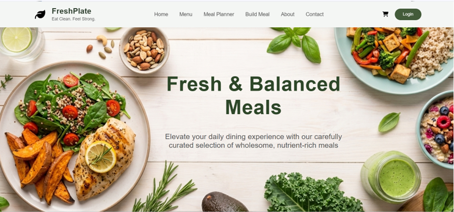
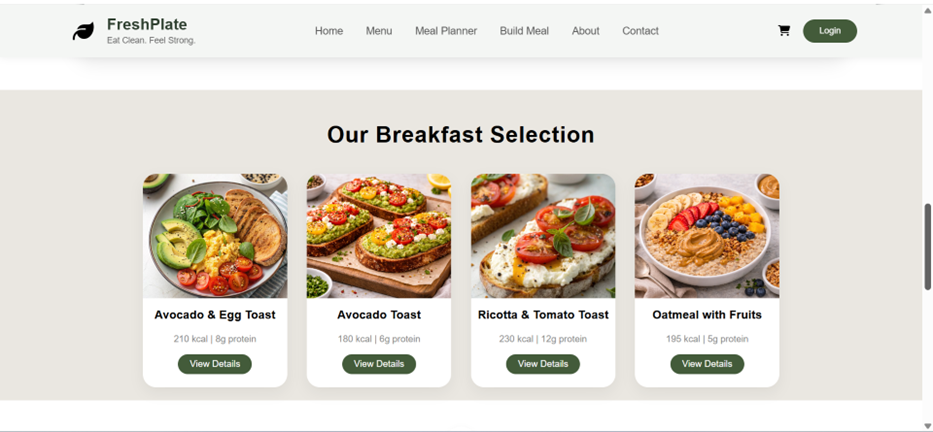
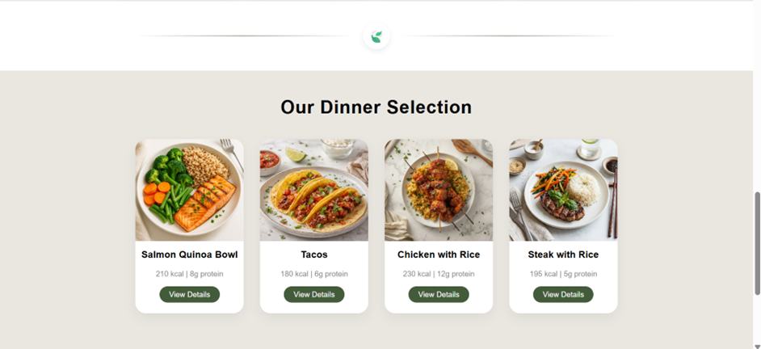
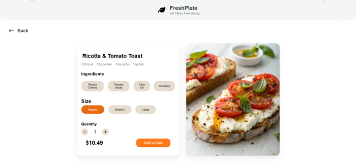
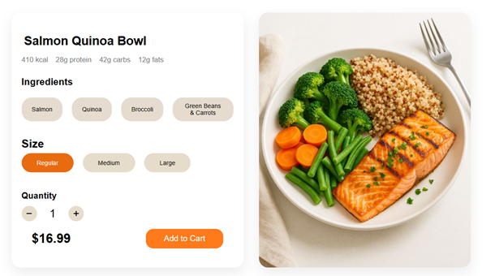
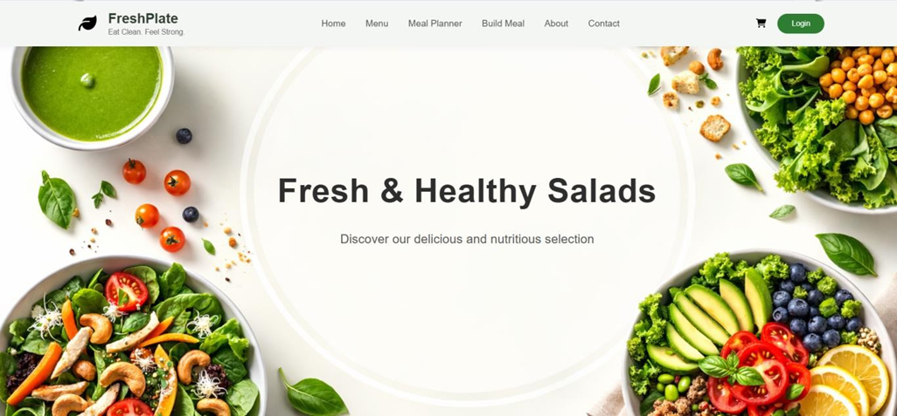
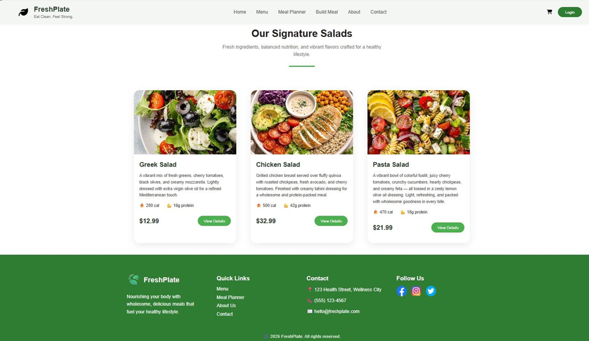
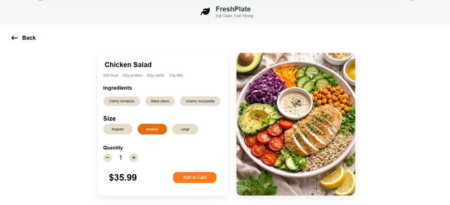

### Meal Planner
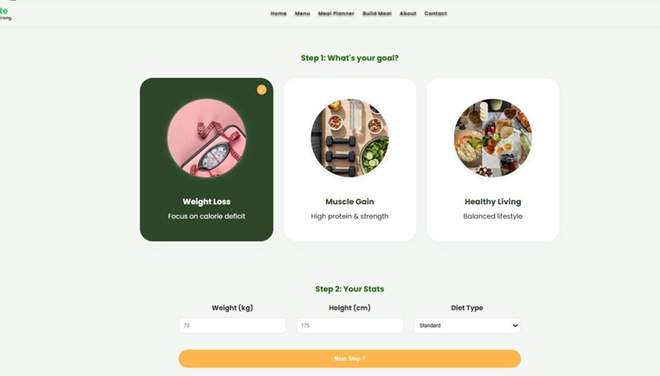
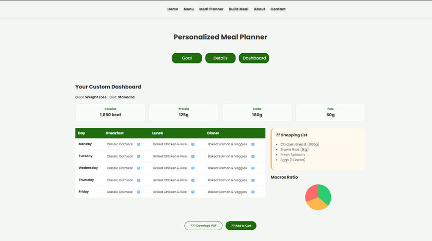

### Build Your Own Meal
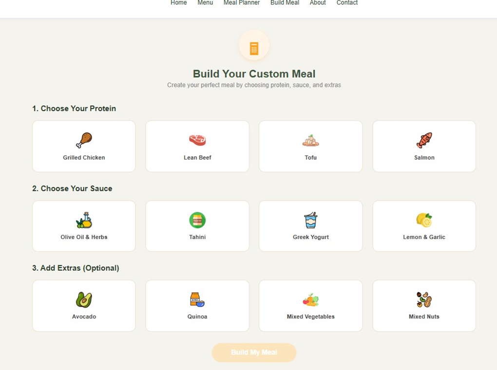

### Shopping Cart
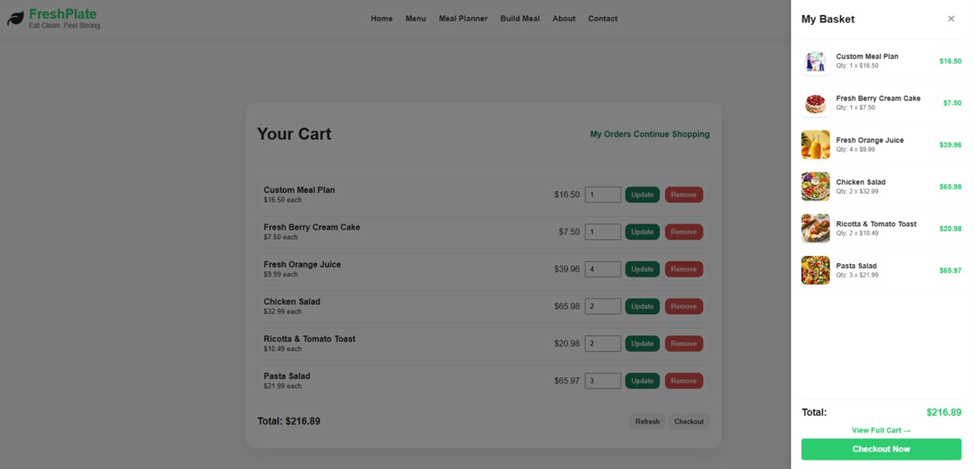
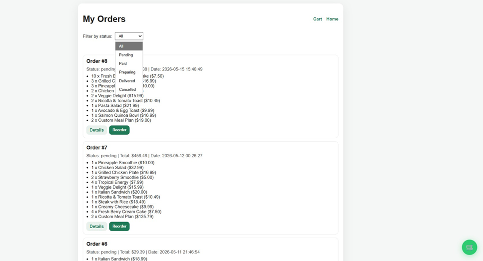

---

## 💡 Future Improvements

- Online payment integration.
- Admin dashboard for managing products and orders.
- Email notifications.
- AI-based meal recommendations.
- Delivery tracking system.

---
